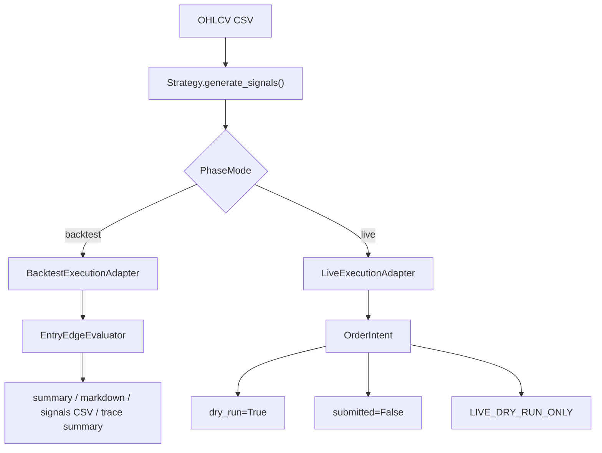

# SignalForge 專案筆記索引

這份筆記是 Obsidian 內的 SignalForge 入口。從現在開始，Obsidian 這個資料夾是專案筆記主來源；push 前再把整理後的筆記同步回 repo 的 `docs/`，讓 GitHub 也保留同一份閱讀版文件。

> [!warning]
> SignalForge 目前只做研究、資料管線驗證與回測稽核，不構成投資建議。`live` 模式仍是 dry-run only，不接 broker、不讀 API key、不送真實訂單。

## 主要入口

- [[01-架構/SignalForge 架構總覽|SignalForge 架構總覽]]
- [[02-規劃/SignalForge 大框架規劃|SignalForge 大框架規劃]]
- [[策略筆記/策略筆記索引|策略筆記索引]]
- [[03-程式疊代/Phase 程式疊代紀錄|Phase 程式疊代紀錄]]
- [[04-實驗記錄/Autoresearch 實驗記錄|Autoresearch 實驗記錄]]
- [[04-實驗記錄/台積電資料與三策略回測|台積電資料與三策略回測]]

## 目前狀態

- Repo：`C:\Projects\signal-forge`
- GitHub：`gary1033/signal-forge`
- 主線：Phase 工作流可切換 `backtest` 與 `live`。
- `backtest`：優先 deterministic artifacts、regression tests、報表可稽核性。
- `entry-edge`：支援單一固定持有期，也可用 `--hold-bars-list` 輸出多持有期 comparison JSON/Markdown。
- `live`：只產生 dry-run `OrderIntent`，安全邊界由 `LIVE_DRY_RUN_ONLY` 鎖住。
- 最新整理基線：readiness score 目標仍為 `110`，固定 guard 是 `python -m unittest discover -s tests` 與 `git diff --check`。

## 筆記分工

| 區塊 | 用途 |
|---|---|
| `01-架構/` | 說明 SignalForge 的模組、資料流、PhaseMode 與 live dry-run 安全邊界。 |
| `02-規劃/` | 放大框架方向、Phase 分期、資料準備、策略蒸餾規則與下一步 backlog。 |
| `策略筆記/` | 一種策略一份筆記，包含策略假設、進出場條件、風險、圖片解說。 |
| `03-程式疊代/` | 保存程式與 artifact contract 的疊代紀錄。 |
| `04-實驗記錄/` | 保存 automation / backtest / 資料實驗結果。 |

## Push 前同步契約

每次準備 push 前，先以這個 Obsidian 資料夾為主來源，將目前整理後的筆記與策略圖片同步到 repo：

```powershell
[Console]::OutputEncoding = [System.Text.Encoding]::UTF8
cd C:\Projects\signal-forge
# 清空 docs 後複製 Obsidian SignalForge 筆記進 docs
```

同步後再跑固定驗證：

```powershell
$env:PYTHONPATH = "src"
python tools\phase_readiness_score.py
python -m unittest discover -s tests
git diff --check
```

## Live 安全邊界


