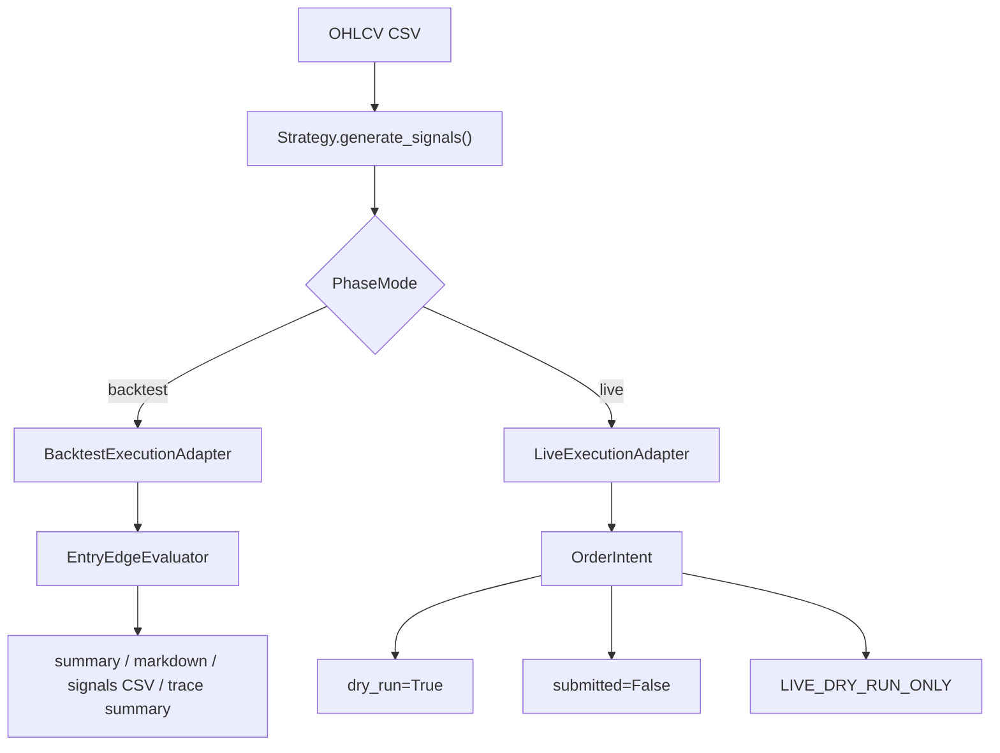

# SignalForge 專案筆記索引

這份筆記是 Obsidian 內的 SignalForge 入口。從現在開始，Obsidian 這個資料夾是專案筆記主來源；push 前再把整理後的筆記同步回 repo 的 `docs/`，讓 GitHub 也保留同一份閱讀版文件。

> [!warning]
> SignalForge 目前只做研究、資料管線驗證與回測稽核，不構成投資建議。`live` 模式仍是 dry-run only，不接 broker、不讀 API key、不送真實訂單。

## 主要入口

- [[01-架構/SignalForge 架構總覽|SignalForge 架構總覽]]
- [[01-架構/SignalForge 呼叫程式方式|SignalForge 呼叫程式方式]]
- [[02-規劃/SignalForge 大框架規劃|SignalForge 大框架規劃]]
- [[02-規劃/策略回測與優化評估準則|策略回測與優化評估準則]]
- [[策略筆記/策略筆記索引|策略筆記索引]]
- [[03-程式疊代/Phase 程式疊代紀錄|Phase 程式疊代紀錄]]
- [[04-實驗記錄/Autoresearch 實驗記錄|Autoresearch 實驗記錄]]
- [[04-實驗記錄/台積電資料與三策略回測|台積電資料與三策略回測]]
- [[04-實驗記錄/台積電四策略延伸研究|台積電四策略延伸研究]]
- [[04-實驗記錄/台股多股票策略基準回測|台股多股票策略基準回測]]

## 目前狀態

- Repo：`C:\Projects\signal-forge`
- GitHub：`gary1033/signal-forge`
- 主線：Phase 工作流可切換 `backtest` 與 `live`。
- `backtest`：優先 deterministic artifacts、regression tests、報表可稽核性。
- `entry-edge`：支援單一固定持有期，也可用 `--hold-bars-list` 輸出多持有期 comparison JSON/Markdown。
- `multi_stock_entry_edge_sweep.py`：支援多檔股票、多策略、多持有期一次 sweep，避免只看單一標的 PF。
- `multi_stock_target_state_sweep.py`：支援多檔股票、多策略、1x / 2x / 3x 成本壓力與最大回撤歸因的完整持倉 target-state sweep。
- `vwap-reversion`：可選 `--vwap-regime-filter`，用 `close >= SMA` 阻擋強下跌中的新 long entry。
- `absolute-momentum`：長期趨勢持有 compare-only 候選，要求回看報酬為正且收盤站上長期 SMA。
- `volatility-target`：可選風控 wrapper，只在 realized volatility 過高時縮小 target exposure；目前 `absolute-momentum + vol-target` 是 drawdown control compare-only，不是主候選，因為 drawdown attribution 顯示 worst MDD 仍集中在 `2454` 且 trough 當天仍滿倉。
- `drawdown-risk-off`：可選風控 wrapper，用策略層 proxy equity 追蹤單檔回撤並暫時降到 flat；`20%/60` 已 discard，`25%/120` 與 `vol-target 0.40 + dd-risk-off 25%/120` 只保留 compare-only。
- `walk-forward / OOS`：target-state sweep 已支援 `--walk-forward-windows`；2024-2026 樣本外檢查顯示 Absolute Momentum 系列仍缺 benchmark-relative edge，尚未能視為穩定營利主候選。
- `relative-momentum filter`：target-state sweep 已支援 `--relative-momentum-filter`，用跨股票 lookback return top-N 當股票池白名單；2024-2026 OOS 掃描 `lookback=63/126/252` 與 `topN=1/2/3/4/5/7` 後沒有改善 `Beat B&H`，目前只作 compare-only / discard 結論。
- `portfolio rotation`：新增投組層級相對動能輪動工具 `tools\portfolio_rotation_sweep.py`，用 equal-weight buy-and-hold portfolio 作 benchmark，並輸出 IR、tracking error 與 active MDD；`monthly + 21 bars + top3` 是目前第一個 full-window 與 OOS 都有正 active return 的候選，但 2022-2023 中段 IR 很低，仍需更多 rolling split。
- `live`：只產生 dry-run `OrderIntent`，安全邊界由 `LIVE_DRY_RUN_ONLY` 鎖住。
- 最新整理基線：readiness score 目標仍為 `110`，固定 guard 是 `python -m unittest discover -s tests` 與 `git diff --check`。

## 筆記分工

| 區塊 | 用途 |
|---|---|
| `01-架構/` | 說明 SignalForge 的模組、資料流、PhaseMode、呼叫入口與 live dry-run 安全邊界。 |
| `02-規劃/` | 放大框架方向、Phase 分期、資料準備、策略蒸餾規則、回測評估準則與下一步 backlog。 |
| `策略筆記/` | 一種策略一份筆記，包含策略假設、進出場條件、風險、圖片解說。 |
| `03-程式疊代/` | 保存程式與 artifact contract 的疊代紀錄。 |
| `04-實驗記錄/` | 保存 automation / backtest / 資料實驗結果。 |

## Push 前同步契約

每次準備 push 前，先以這個 Obsidian 資料夾為主來源，將目前整理後的筆記與策略圖片同步到 repo：

```powershell
[Console]::OutputEncoding = [System.Text.Encoding]::UTF8
cd C:\Projects\signal-forge
# 清空 docs 後複製 Obsidian SignalForge 筆記進 docs
```

同步後再跑固定驗證：

```powershell
$env:PYTHONPATH = "src"
python tools\phase_readiness_score.py
python -m unittest discover -s tests
git diff --check
```

## Live 安全邊界


