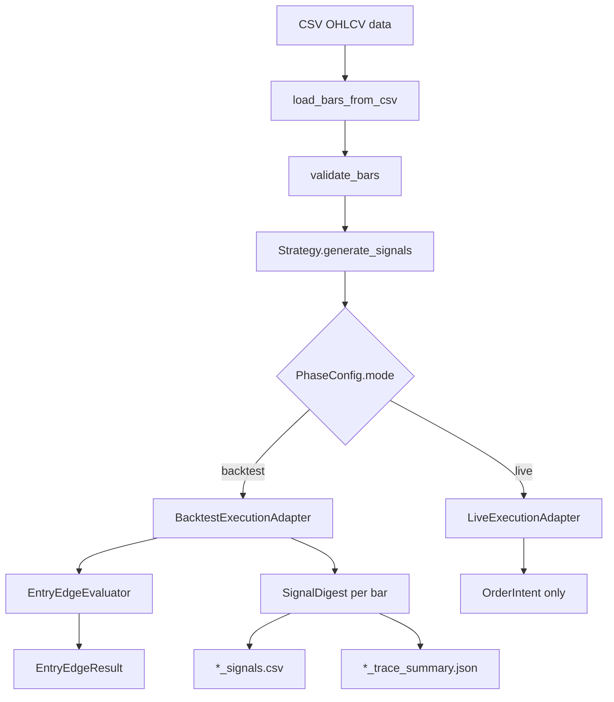

# SignalForge 架構總覽

SignalForge 是研究導向的交易訊號沙盒。它不是把 TradingView / Pine Script 直接搬成可交易系統，而是把腳本背後的 signal、filter、risk rule、exit rule 拆開，轉成可以在 Python 裡驗證的研究假設。

目前主線是 Phase 工作流：同一份 OHLCV CSV、同一個 strategy、同一組參數，必須產生可重複、可比較、可被測試鎖住的 artifacts。這份筆記專注說明架構與安全邊界；策略研究細節放在 [[../策略筆記/策略筆記索引|策略筆記索引]]，規劃方向放在 [[../02-規劃/SignalForge 大框架規劃|大框架規劃]]。

> [!warning]
> 本專案只做研究與回測，不構成投資建議。`live` 模式目前只允許 dry-run order intent，不接 broker、不讀 API key、不送真實訂單。

## 核心模組

| 模組 | 位置 | 責任 |
|---|---|---|
| CLI | `src\signal_forge\cli.py` | 提供 `fetch-data`、`entry-edge`、`phase` 指令，組合資料、策略與輸出。 |
| Market data | `src\signal_forge\market_data.py` | 讀取 OHLCV CSV，驗證 timestamp、OHLC、volume 與資料筆數。 |
| Data fetch | `src\signal_forge\data_fetch.py` | 下載免費日線資料，輸出 SignalForge 固定 CSV 與 manifest。 |
| Strategy | `src\signal_forge\strategy.py`、`src\signal_forge\strategies\` | 提供 `Strategy` contract、hook-based `BarByBarStrategy` 模板、strategy registry，並讓每根 bar 產生一筆 `Signal`。 |
| Entry Edge | `src\signal_forge\entry_edge.py` | 第一階段 long-only 固定持有期進場優勢評估。 |
| Phase | `src\signal_forge\phase.py` | 定義 `PhaseMode`、`PhaseConfig`、`PhaseRunner` 與 backtest/live adapters。 |
| Reporting | `src\signal_forge\reporting.py` | 寫出 JSON、Markdown、trade log、signals CSV、trace summary，並做 contract validation。 |
| Readiness | `tools\phase_readiness_score.py` | bounded autoresearch 使用的輕量 deterministic readiness metric。 |

## Strategy OOP 模板

策略開發目前採用 hook-based OOP 模板。外部 contract 仍是 `Strategy.generate_signals(bars) -> list[Signal]`，因此 `PhaseRunner`、`EntryEdgeEvaluator`、reporting schema 與 CLI 輸出都不需要知道策略內部如何拆分。

模板分工如下：

- `Signal`：每根 bar 的輸出格式，保留 `index`、`timestamp`、`target_position`、`reason`、`score`。
- `StrategyDecision`：策略在單根 bar 的內部決策結果，由 template 轉成 `Signal`。
- `BarByBarStrategy`：負責 `generate_signals()` 的固定流程，包含準備 context、逐根 bar 呼叫 hook、傳入 `previous_target_position`、維持 signal 與 bar 對齊。
- 具體策略只實作 `prepare_context(...)` 與 `decide_bar(...)`，例如 SMA context 放 fast / slow SMA，VWAP context 放 rolling VWAP / rolling std，Confluence context 放 SMA / VWAP / RSI / volume。
- `strategies.registry` 提供 Phase 1 strategy factory；CLI 仍以 `sma-crossover`、`vwap-reversion`、`confluence-score` 建構 long-only 策略。

這個模板是工程結構重構，不改變三個既有策略的交易語意。`VolumeFilteredStrategy` 仍是外層 wrapper，只在 CLI 啟用 `--volume-filter` 時套用。

## PhaseMode 分流

`PhaseMode` 目前只有兩種：

- `backtest`：回測與 artifact 產生路徑，`dry_run=False`。
- `live`：dry-run intent 路徑，`dry_run=True`。

`PhaseConfig` 是 mode semantics 的單一來源。CLI 不應自己維護一份 dry-run 判斷，而是交給 `PhaseConfig.__post_init__()` 推導：

- `mode="backtest"` 時拒絕 `dry_run=True`。
- `mode="live"` 時拒絕 `dry_run=False`，並強制設成 `True`。
- `hold_bars_per_day` 必須為正數。



## Backtest 路徑

`BacktestExecutionAdapter` 會先呼叫 strategy 產生 signals，再用 `EntryEdgeEvaluator` 評估 long entry edge。這個階段不是完整投資組合回測，而是在回答：訊號於 bar close 後成立，下一根 bar open 進場，固定持有 `hold_bars_per_day` 後離場，是否有短期進場優勢。

策略可以在 CLI 層套用可選 wrapper。第一個 wrapper 是 `VolumeFilteredStrategy`，啟用 `--volume-filter` 時才生效；它不改原策略本體，而是在原策略輸出 positive target 後，要求 `volume >= sma(volume, volume_window) * volume_multiplier` 才保留 long 狀態。預設不啟用，避免破壞既有回測 contract。

輸出包含：

- Phase summary JSON：固定 schema、排序與 trailing newline。
- Phase markdown：固定文字 contract，顯示 digest invariants、top reasons 與 trace summary 摘要。
- Entry Edge outputs：summary JSON、markdown、trade log CSV。
- `*_signals.csv`：每根 bar 的 signal digest。
- `*_trace_summary.json`：由 signal digest 派生的 counts、timestamp、reason、position buckets 與 hash。

## SignalDigest 與 trace summary

`SignalDigest` 是 backtest artifact 的核心中介格式。每根 bar 至少包含：

- `index`
- `timestamp`
- `target_position`
- `position_change`
- `reason`
- `score`
- `is_long_entry`
- `is_flatten`

Reporting 層再從 signals CSV 推導 trace summary，並交叉驗證：

- timestamp 必須遞增且 ISO-8601。
- reason 必須 deterministic、ASCII-only、single-line、non-empty。
- `position_change` 必須等於 target position delta。
- entry / flatten / hold / position bucket counts 必須一致。
- `signal_digest_sha256` 必須和 signals CSV 內容一致。

## Live dry-run 安全邊界

`LiveExecutionAdapter` 目前只允許產生 `OrderIntent`。以下 invariant 不能破壞：

- `dry_run=True`
- `submitted=False`
- `safety_note` 含 `LIVE_DRY_RUN_ONLY`
- 無 broker 連線
- 無 API key / credential 讀取
- 無真實訂單送出

`OrderIntent` 的存在是為了先驗證 live intent schema 與安全稽核，不代表已經開放交易能力。

## 驗證命令

```powershell
[Console]::OutputEncoding = [System.Text.Encoding]::UTF8
cd C:\Projects\signal-forge
$env:PYTHONPATH = "src"
python tools\phase_readiness_score.py
python -m unittest discover -s tests
git diff --check
```

通過條件維持：readiness score `110`、unit tests 全部通過、`git diff --check` clean。
