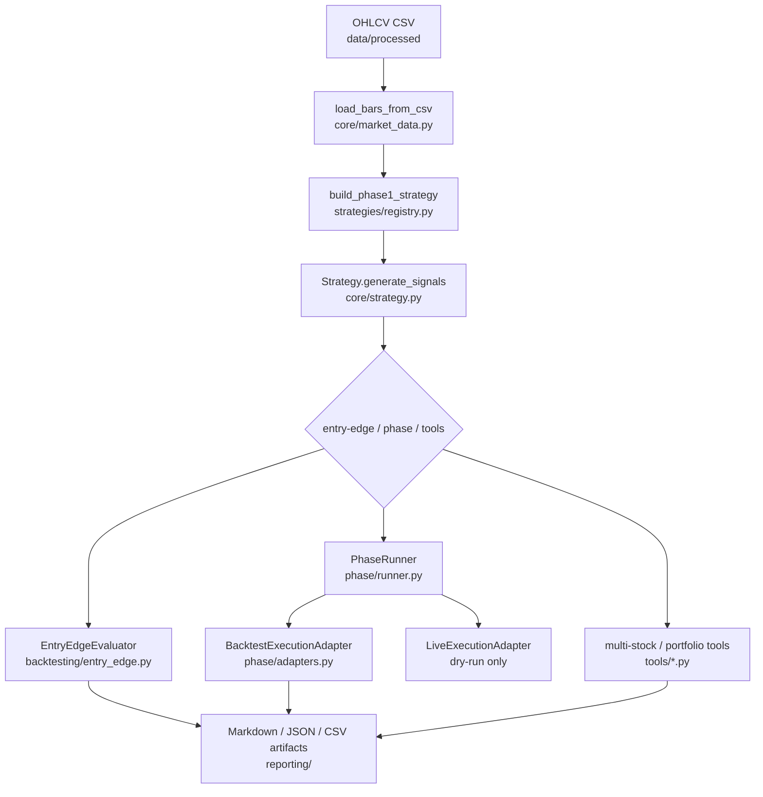

# SignalForge 資料夾與程式碼導覽

這份文件是 SignalForge 的閱讀地圖與維護手冊。目標是讓新讀者可以快速回答三個問題：

1. 這個 project 整體在做什麼？
2. 每個主要資料夾、module、function 或 class 在哪裡，負責什麼？
3. 想修改某個功能、策略、參數、報表或測試時，應該先去哪裡找？

策略績效與 keep / discard 結論不放在這裡。策略研究請看 [[../策略筆記/策略筆記索引|策略筆記索引]]，評估 gate 請看 [[../02-規劃/策略回測與優化評估準則|策略回測與優化評估準則]]，實驗紀錄請看 [[../04-實驗記錄/Autoresearch 實驗記錄|Autoresearch 實驗記錄]]。

> [!warning]
> SignalForge 目前仍是研究與回測工具。`live` 路徑只能產生 dry-run order intent，不接 broker、不讀 credential、不送真實訂單。

## 一句話理解資料流



最核心的 contract 是：資料先轉成 `Bar`，策略輸出每根 bar 一筆 `Signal`，回測與 reporting 只吃這份 signal / target-position 資料，不應各自重新發明資料流。

## 建議閱讀順序

| 順序 | 讀哪裡 | 目的 |
|---:|---|---|
| 1 | `README.md` | 先知道怎麼跑資料下載、單策略、完整參數與多股票工具。 |
| 2 | `docs\01-架構\SignalForge 架構總覽.md` | 建立 Phase、Entry Edge、SignalDigest、live dry-run 的全貌。 |
| 3 | `src\signal_forge\core\market_data.py`、`core\strategy.py`、`core\signals.py` | 理解資料與 signal contract。 |
| 4 | `src\signal_forge\strategies\registry.py` 與目標策略檔 | 理解 CLI 如何建立策略，以及 default parameter 從哪裡來。 |
| 5 | `src\signal_forge\backtesting\entry_edge.py` | 理解單策略固定持有期如何計算 trade log 與 PF。 |
| 6 | `src\signal_forge\phase\config.py`、`adapters.py`、`runner.py` | 理解 Phase 如何把 backtest 與 live dry-run 分流。 |
| 7 | `src\signal_forge\reporting\` | 理解 artifacts 如何寫出、驗證與保持 deterministic。 |
| 8 | `src\signal_forge\cli\parser.py`、`strategy_options.py`、`commands.py` | 理解使用者輸入如何接到正式 API。 |
| 9 | `tools\*.py` | 理解多股票、portfolio rotation、調整價資料與比較工具。 |
| 10 | `tests\*.py` | 找對應 regression，修改時先看測試期望。 |

## Repo 根目錄

| 路徑 | 內容 | 修改時機 |
|---|---|---|
| `AGENTS.md` | Codex 與夜間 automation 的操作守則。 | 改 workflow、驗證命令、文件同步規則時才更新。 |
| `README.md` | 專案入口與可複製執行 runbook。 | CLI、策略名稱、default parameter、資料流程或常用工具改了就更新。 |
| `pyproject.toml` | Python package metadata 與 `signal-forge` console script。 | 改 package 名稱、entry point、依賴或 Python 版本時更新。 |
| `data\sample\` | deterministic sample input。 | 測試或 README demo 需要小型固定資料時更新。 |
| `data\raw\` | 下載後的原始資料。 | 一般不手改，應由 `fetch-data` 或資料工具產生。 |
| `data\processed\` | SignalForge 固定 OHLCV schema。 | 回測主要輸入來源，欄位需維持 `timestamp,open,high,low,close,volume`。 |
| `reports\generated\` | 本機產生的回測 artifacts。 | 通常不是 source of truth，除非特定實驗需要保存。 |
| `src\signal_forge\` | production package。 | 正式功能改動都從這裡進。 |
| `tests\` | `unittest` regression suite。 | 每個功能改動都應有對應測試或明確說明為什麼不用補。 |
| `tools\` | 多股票研究、資料建立、比較與 readiness 工具。 | 放 deterministic、可重跑的研究工具，不放 live 下單能力。 |
| `docs\` | Obsidian `SignalForge` 筆記的 repo mirror。 | 同步方向固定為 Obsidian -> repo `docs\`。 |

## 修改需求速查表

| 你想修改 | 先看 | 同步更新 |
|---|---|---|
| 新增股票資料來源或修資料格式 | `src\signal_forge\data\fetch.py`、`core\market_data.py` | `tests\test_data_fetch.py`、`tests\test_market_data.py`、README 資料段落 |
| 新增指標 | `src\signal_forge\core\indicators.py` | `tests\test_indicators.py` |
| 新增策略 | `src\signal_forge\strategies\<name>.py`、`strategies\registry.py` | `tests\test_strategy_factory.py`、策略筆記、README 策略呼叫 |
| 修改策略 default parameter | `src\signal_forge\strategies\registry.py` | README、`docs\01-架構\SignalForge 呼叫程式方式.md`、策略筆記 |
| 新增策略 CLI 參數 | `src\signal_forge\cli\strategy_options.py` | `tests\test_cli.py`、README 完整版範例 |
| 新增 subcommand | `src\signal_forge\cli\parser.py`、`commands.py` | `tests\test_cli.py`、README |
| 修改 entry-edge 評估邏輯 | `src\signal_forge\backtesting\entry_edge.py` | `tests\test_entry_edge.py`、reporting tests |
| 修改 Phase backtest/live 分流 | `src\signal_forge\phase\config.py`、`adapters.py`、`runner.py` | `tests\test_phase.py`、live dry-run safety 文件 |
| 修改 markdown / JSON / CSV artifact | `src\signal_forge\reporting\` | `tests\test_reporting.py`、exact-text regression |
| 修改多股票 entry-edge | `tools\multi_stock_entry_edge_sweep.py` | `tests\test_multi_stock_sweep_tool.py` |
| 修改 target-state 多股票回測 | `tools\multi_stock_target_state_sweep.py` | `tests\test_multi_stock_sweep_tool.py` |
| 修改 portfolio rotation 回測邏輯 | `tools\portfolio_rotation_sweep.py` | `tests\test_portfolio_rotation_sweep_tool.py` |
| 修改 portfolio rotation 參數掃描 | `tools\portfolio_rotation_grid_search.py` | `tests\test_portfolio_rotation_grid_search_tool.py` |
| 修改 portfolio rotation 股票池 audit / selection | `tools\portfolio_rotation_universe_audit.py`、`tools\portfolio_rotation_universe_select.py` | `tests\test_portfolio_rotation_universe_audit_tool.py`、`tests\test_portfolio_rotation_universe_select_tool.py` |
| 修改 portfolio rotation group diagnostics / promotion gate | `tools\portfolio_rotation_group_regime_validation.py`、`tools\portfolio_rotation_group_breadth_validation.py`、`tools\portfolio_rotation_promotion_gate.py` | 對應 `tests\test_portfolio_rotation_*_tool.py` |
| 修改 adjusted price 工具 | `tools\build_twse_adjusted_ohlcv*.py` | 對應 `tests\test_build_twse_adjusted_ohlcv*_tool.py` |
| 修改 raw / adjusted 比較 | `tools\compare_portfolio_rotation_reports.py` | `tests\test_compare_portfolio_rotation_reports_tool.py` |
| 修改測試 fixture | `tests\helpers.py` | 確認 production code 沒依賴 test helper |

## Public API 與相容入口

`src\signal_forge\__init__.py` 會 re-export 常用 public API。舊 import path 也保留薄 wrapper，避免歷史使用方式突然壞掉。

| 檔案 | 責任 |
|---|---|
| `src\signal_forge\__init__.py` | 對外匯出 `PhaseConfig`、`PhaseRunner`、策略、資料載入與 reporting 常用入口。 |
| `src\signal_forge\market_data.py` | 舊路徑 wrapper，轉出 `core.market_data`。 |
| `src\signal_forge\strategy.py` | 舊路徑 wrapper，轉出 `core.strategy`。 |
| `src\signal_forge\entry_edge.py` | 舊路徑 wrapper，轉出 `backtesting.entry_edge`。 |
| `src\signal_forge\backtester.py` | 舊路徑 wrapper，轉出 `backtesting.backtester`。 |
| `src\signal_forge\data_fetch.py` | 舊路徑 wrapper，轉出 `data.fetch.fetch_market_data`。 |
| `src\signal_forge\indicators.py` | 舊路徑 wrapper，轉出 `core.indicators`。 |

這層只做相容與 re-export。新增業務邏輯應放到 `core\`、`strategies\`、`backtesting\`、`phase\`、`reporting\`、`data\` 或 `cli\`。

## Core function map

`core` 是所有流程共用的資料與策略 contract 層，不依賴 CLI、reporting 或 tools。

### `src\signal_forge\core\market_data.py`

| Function / Class | 用途 |
|---|---|
| `Bar` | 單根 OHLCV K 線資料結構。 |
| `BarValidationResult` | 保存資料驗證結果與錯誤訊息，`is_valid` 判斷是否可用。 |
| `MarketDataValidationError` | 資料無法用於研究時的明確例外。 |
| `load_bars_from_csv(path, validate=True)` | 讀取 SignalForge OHLCV CSV，轉成 `list[Bar]`，可選擇立即驗證。 |
| `validate_bars(bars, min_bars=1)` | 檢查 timestamp 排序、重複、OHLC 合理性、volume 與最小樣本數。 |
| `closes(bars)` | 擷取 close 序列，供 indicator 與 strategy 使用。 |
| `volumes(bars)` | 擷取 volume 序列，供 VWAP、成交量濾網與 liquidity gate 使用。 |

### `src\signal_forge\core\indicators.py`

| Function | 用途 |
|---|---|
| `sma(values, window)` | 計算簡單移動平均，暖機不足回傳 `None`。 |
| `ema(values, window)` | 計算指數移動平均，先用 SMA 種子再遞推。 |
| `rolling_std(values, window)` | 計算 rolling standard deviation。 |
| `rsi(values, window)` | 計算 0 到 100 的 RSI 動能指標。 |
| `rolling_vwap(closes, volumes, window)` | 用 close 與 volume 計算 rolling VWAP。 |

### `src\signal_forge\core\strategy.py`

| Function / Class | 用途 |
|---|---|
| `Signal` | 每根 bar 的策略輸出，包含 index、timestamp、target position、reason、score。 |
| `StrategyDecision` | `BarByBarStrategy.decide_bar(...)` 的單根 bar 內部決策結果。 |
| `Strategy` | 抽象 contract，正式策略需提供 `name` 與 `generate_signals(bars)`。 |
| `BarByBarStrategy.generate_signals(...)` | 固定逐 bar 流程，確保 signal 與 bar 一對一對齊。 |
| `BarByBarStrategy.prepare_context(...)` | 子策略預先計算 indicators 或中介資料。 |
| `BarByBarStrategy.decide_bar(...)` | 子策略針對單根 bar 回傳 target position、reason、score。 |

### `src\signal_forge\core\signals.py`

| Function / Class | 用途 |
|---|---|
| `SignalDigest` | Reporting 使用的 normalized signal row。 |
| `normalize_signal_reason(reason)` | 將 reason 正規化為 deterministic、single-line、ASCII-only 欄位。 |
| `generate_validated_signals(strategy, bars)` | 集中呼叫 `strategy.generate_signals(...)`，驗證 signal 筆數等於 bars。 |
| `build_signal_digests(signals)` | 從原始 `Signal` 推導 position delta、entry/flatten flags 與 normalized reason。 |

## Strategy function map

策略檔只負責訊號邏輯，不負責 CLI parser、artifact 寫出或資料下載。

| 檔案 | 主要 Class / Function | 用途 |
|---|---|---|
| `strategies\registry.py` | `StrategyParameterDefaults` | 集中保存 README / reporting / CLI 會用到的 default parameter。 |
| `strategies\registry.py` | `build_strategy(...)` | 依 strategy name 與參數建立支援的策略。 |
| `strategies\registry.py` | `build_phase1_strategy(...)` | 建立 Phase 1 long-only 策略，並依序套用 volume filter、signal cooldown、volatility target、drawdown risk-off wrapper。 |
| `strategies\sma_crossover.py` | `SmaCrossoverStrategy.prepare_context(...)` | 預先計算 fast / slow SMA。 |
| `strategies\sma_crossover.py` | `SmaCrossoverStrategy.decide_bar(...)` | `fast > slow` 做多，否則空手。 |
| `strategies\vwap_reversion.py` | `VwapReversionStrategy.prepare_context(...)` | 預先計算 rolling VWAP、std 與可選 regime SMA。 |
| `strategies\vwap_reversion.py` | `VwapReversionStrategy.decide_bar(...)` | 價格低於 VWAP band 時做多，回到 VWAP 附近出場；regime filter 只阻擋新 long entry。 |
| `strategies\confluence_score.py` | `ConfluenceScoreStrategy.prepare_context(...)` | 預先計算 SMA、RSI、VWAP、均量。 |
| `strategies\confluence_score.py` | `ConfluenceScoreStrategy.decide_bar(...)` | 依趨勢、價格、VWAP、RSI、volume 累積 score，達 threshold 後做多。 |
| `strategies\absolute_momentum.py` | `AbsoluteMomentumStrategy.prepare_context(...)` | 擷取 close 並計算長期 trend SMA。 |
| `strategies\absolute_momentum.py` | `AbsoluteMomentumStrategy.decide_bar(...)` | 回看報酬為正且 close 高於 trend SMA 時做多。 |
| `strategies\orb_volume_vwap.py` | `OrbVolumeVwapStrategy.prepare_context(...)` | 建立 intraday ORB 所需的 opening range、VWAP、EMA、session context。 |
| `strategies\orb_volume_vwap.py` | `OrbVolumeVwapStrategy.decide_bar(...)` | 在同 session confirmed-bar contract 內判斷 OR breakout、volume、VWAP / EMA refinements。 |
| `strategies\volume_filter.py` | `VolumeFilteredStrategy.generate_signals(...)` | 包住底層策略，只在相對成交量通過時保留 long target。 |
| `strategies\signal_cooldown.py` | `SignalCooldownStrategy.generate_signals(...)` | 接受 long entry 後封鎖指定 bar 數內的新 long entry。 |
| `strategies\volatility_target.py` | `VolatilityTargetStrategy.generate_signals(...)` | realized volatility 高於目標時下修非零 target，不加槓桿。 |
| `strategies\drawdown_risk_off.py` | `DrawdownRiskOffStrategy.generate_signals(...)` | proxy equity 回撤超過門檻時暫時降到 flat。 |

目前 CLI 支援策略名稱：

```text
sma-crossover
vwap-reversion
confluence-score
absolute-momentum
orb-volume-vwap
```

## Backtesting function map

### `src\signal_forge\backtesting\entry_edge.py`

| Function / Class | 用途 |
|---|---|
| `EntryEdgeConfig` | 固定持有期 entry-edge 的資金、成本、持有期與 PF 門檻設定。 |
| `EntryEdgeTrade` | 單筆 entry / exit 交易紀錄。 |
| `EntryEdgeEquityPoint` | Entry-edge 權益曲線的一個點。 |
| `EntryEdgeResult` | 單一策略與設定的完整 entry-edge summary。 |
| `EntryEdgeComparisonResult` | 多持有期比較的 summary。 |
| `EntryEdgeEvaluator.run(strategy, bars)` | 從策略產生 signals，再計算 long entry 固定持有期結果。 |
| `EntryEdgeEvaluator.run_from_signals(strategy_name, bars, signals)` | 使用已產生的 signals 計算 entry-edge，Phase 用它避免重複呼叫 stateful strategy。 |
| `run_entry_edge_hold_comparison(...)` | 同一策略、資料與成本下，依 `--hold-bars-list` 跑多個固定持有期。 |

### `src\signal_forge\backtesting\backtester.py`

| Function / Class | 用途 |
|---|---|
| `BacktestConfig` | close-to-close target exposure backtest 的資金與成本設定。 |
| `Trade` | legacy backtester trade record。 |
| `EquityPoint` | legacy equity curve point。 |
| `BacktestResult` | legacy target-state 回測結果。 |
| `Backtester.run(strategy, bars)` | 依每根 signal 的 target position 做 close-to-close target exposure 回測。 |

## Phase function map

`phase` 是主工作流，負責把 data、strategy、adapter 與 reporting 串起來。

| 檔案 | Function / Class | 用途 |
|---|---|---|
| `phase\config.py` | `PhaseConfig` | 保存 mode、strategy、csv、output、hold period，並在 `__post_init__` 鎖住 backtest/live dry-run 語意。 |
| `phase\config.py` | `parse_phase_mode(value)` | 解析 CLI 字串為 `backtest` 或 `live`。 |
| `phase\runner.py` | `PhaseRunner.__init__(...)` | 保存或注入 backtest/live adapter，方便測試替換。 |
| `phase\runner.py` | `PhaseRunner.run(config, strategy, bars)` | 驗證 bars 後依 mode 分派到 adapter。 |
| `phase\adapters.py` | `BacktestExecutionAdapter.run(...)` | 單次產生 signals，交給 `EntryEdgeEvaluator.run_from_signals(...)` 與 `build_signal_digests(...)`。 |
| `phase\adapters.py` | `LiveExecutionAdapter.run(...)` | 只把新 long entry 轉成 dry-run `OrderIntent`，不連 broker、不送單。 |
| `phase\intents.py` | `OrderIntent` | live dry-run 的 order intent schema，`safety_note` 必須含 `LIVE_DRY_RUN_ONLY`。 |
| `phase\results.py` | `PhaseExecutionResult` | Phase adapter 回傳給 reporting 的統一結果物件。 |

## Reporting function map

`reporting` 負責 artifact serialization、validation 與 markdown rendering。它不應重新計算策略 signals。

| 檔案 | Function / Class | 用途 |
|---|---|---|
| `reporting\paths.py` | path helper | 集中 output path 與 run-name 組裝。 |
| `reporting\entry_edge.py` | re-export writer | Entry Edge summary、markdown、trade log writer API。 |
| `reporting\phase.py` | re-export writer | Phase summary、signals CSV、trace summary、markdown writer API。 |
| `reporting\signal_digest.py` | trace helper | Signal digest CSV 與 trace summary builder / serializer。 |
| `reporting\validators.py` | validator API | artifact ordering、reason、timestamp、position invariants。 |
| `reporting\markdown.py` | markdown helper | 人讀報表 rendering helper。 |
| `reporting\_legacy.py` | `write_entry_edge_outputs(...)` | 寫出 entry-edge markdown、summary JSON、trade log CSV。 |
| `reporting\_legacy.py` | `write_entry_edge_comparison_outputs(...)` | 寫出多持有期 comparison JSON / Markdown。 |
| `reporting\_legacy.py` | `write_phase_outputs(...)` | 寫出 Phase summary JSON、markdown、signals CSV、trace summary。 |
| `reporting\_legacy.py` | `validate_signal_digest_csv(...)` | 讀回 signals CSV 與 trace summary 做 cross-check。 |
| `reporting\_legacy.py` | `validate_phase_summary(...)` | 驗證 Phase summary 格式、語意與 live safety。 |
| `reporting\_legacy.py` | `validate_signal_digests(...)` | 驗證記憶體中的 `SignalDigest` 清單。 |
| `reporting\_legacy.py` | `validate_trace_summary(...)` | 驗證 trace summary 與 signal digest 統計一致。 |
| `reporting\_orb_attribution.py` | `build_orb_filter_attribution(...)` | 從 ORB signal digests 推導 accepted、hold、blocked 與 filter group 統計。 |
| `reporting\_orb_attribution.py` | `validate_orb_filter_attribution_dict(...)` | 驗證 ORB attribution schema 與統計關係。 |

## Data function map

### `src\signal_forge\data\fetch.py`

| Function / Class | 用途 |
|---|---|
| `FetchDataResult` | data fetch command 的輸出摘要，包含 raw / processed / manifest path。 |
| `NormalizedBar` | provider 原始列轉成 SignalForge OHLCV 前的中介格式。 |
| `NormalizedBar.to_bar()` | 轉成 core `Bar`，讓同一套 validation 可以重用。 |
| `fetch_market_data(...)` | 依 market code 下載日線資料，驗證後寫 raw CSV、processed CSV、manifest。 |
| `fetch_twse_daily_stock(...)` | 從 TWSE 月資料端點抓取台股日線並正規化。 |
| `fetch_stooq_daily_stock(...)` | 從 Stooq daily CSV 抓美股日線，處理 API key 要求。 |
| `parse_twse_row(...)` | 解析 TWSE 民國日期、含逗號數字與 OHLCV 欄位。 |
| `parse_stooq_csv(...)` | 解析 Stooq CSV 並轉成 `NormalizedBar`。 |
| `format_signal_forge_csv(...)` | 輸出固定 OHLCV CSV schema。 |

## CLI function map

| 檔案 | Function | 用途 |
|---|---|---|
| `cli\__init__.py` | `main(argv=None)` | CLI 入口，解析 argv 後分派 command handler。 |
| `cli\parser.py` | `build_parser()` | 建立 argparse parser 與 `fetch-data`、`entry-edge`、`phase` subcommands。 |
| `cli\strategy_options.py` | `add_strategy_arguments(parser)` | 註冊 `entry-edge` 與 `phase` 共用策略參數。 |
| `cli\strategy_options.py` | `build_strategy_from_args(args)` | 將 argparse namespace 轉成 Phase 1 strategy 與 wrapper。 |
| `cli\strategy_options.py` | `strategy_spec_from_args(args, strategy)` | 將策略設定整理成 deterministic metadata，寫入 artifact。 |
| `cli\strategy_options.py` | `orb_runtime_spec_from_bars(args, bars)` | 從 ORB intraday bars 推導 run-level session / opening-range metadata。 |
| `cli\commands.py` | `run_entry_edge_command(args)` | 載入 CSV、建立策略、執行 entry-edge、寫 artifacts、列印輸出路徑。 |
| `cli\commands.py` | `run_phase_command(args)` | 載入 CSV、建立策略、執行 PhaseRunner、寫 Phase artifacts。 |
| `cli\commands.py` | `run_fetch_data_command(args)` | 呼叫 data fetch API，下載並寫出 raw / processed / manifest。 |
| `cli\commands.py` | `parse_hold_bars_list(value)` | 解析 `--hold-bars-list` 成正整數 tuple。 |

## Tools function map

`tools` 是研究與維護工具，不是 live 下單介面。工具輸出要 deterministic，方便寫進實驗紀錄。

| 檔案 | Function / Class | 用途 |
|---|---|---|
| `tools\phase_readiness_score.py` | `main()` | 計算 bounded autoresearch readiness score，目標維持 `110`。 |
| `tools\multi_stock_entry_edge_sweep.py` | `run_sweep(...)` | 對多股票、多策略、多持有期跑 entry-edge。 |
| `tools\multi_stock_entry_edge_sweep.py` | `build_aggregates(...)` | 依 strategy / hold 分組，計算跨股票 aggregate PF 與通過數。 |
| `tools\multi_stock_entry_edge_sweep.py` | `format_markdown(...)` | 將 sweep 結果轉成人讀 Markdown。 |
| `tools\multi_stock_target_state_sweep.py` | `run_sweep(...)` | 對多股票、策略、成本倍率執行 target-state backtest。 |
| `tools\multi_stock_target_state_sweep.py` | `build_relative_momentum_allowlist(...)` | 建立跨股票相對動能 top-N 白名單。 |
| `tools\multi_stock_target_state_sweep.py` | `run_walk_forward_sweep(...)` | 依 walk-forward windows 重跑 target-state sweep。 |
| `tools\multi_stock_target_state_sweep.py` | `build_aggregates(...)` | 彙總跨股票報酬、benchmark excess、風險與 drawdown attribution。 |
| `tools\portfolio_rotation_sweep.py` | `load_rotation_inputs(...)` | 載入多檔股票 OHLCV，套用共同日期窗。 |
| `tools\portfolio_rotation_sweep.py` | `align_close_table(...)` | 對齊多檔 close matrix。 |
| `tools\portfolio_rotation_sweep.py` | `align_traded_value_table(...)` | 對齊成交金額 matrix，供 liquidity gate 使用。 |
| `tools\portfolio_rotation_sweep.py` | `run_portfolio_rotation(...)` | 執行 long-only relative momentum portfolio rotation，支援 market regime、breadth、group breadth、liquidity、group cap、consecutive cap、re-entry cooldown、group contribution gate 與 vol target。 |
| `tools\portfolio_rotation_sweep.py` | `run_equal_weight_benchmark(...)` | 建立 equal-weight buy-and-hold portfolio benchmark。 |
| `tools\portfolio_rotation_sweep.py` | `run_portfolio_rotation_sweep(...)` | 對同一股票池跑多個成本倍率。 |
| `tools\portfolio_rotation_sweep.py` | `build_rolling_windows(...)` | 自動產生 rolling windows。 |
| `tools\portfolio_rotation_sweep.py` | `format_markdown(...)` | 輸出 portfolio rotation 報表 Markdown。 |
| `tools\portfolio_rotation_grid_search.py` | `run_portfolio_rotation_grid_search(...)` | 掃描 top-N、breadth、liquidity、max consecutive 等候選組合並依 gate 排序。 |
| `tools\portfolio_rotation_grid_search.py` | `_build_candidates(...)` | 從 CLI list 參數展開 deterministic candidate grid。 |
| `tools\portfolio_rotation_grid_search.py` | `_gate_failure_reasons(...)` | 將 full IR、rolling IR、rolling excess、MDD、group concentration 轉成失敗原因。 |
| `tools\portfolio_rotation_universe_audit.py` | `run_universe_audit(...)` | 檢查股票池歷史長度、平均成交金額、群組成員數與 adjusted CSV availability。 |
| `tools\portfolio_rotation_universe_audit.py` | `_build_audit_row(...)` | 對單檔股票建立 audit row 與 eligibility 判斷。 |
| `tools\portfolio_rotation_universe_select.py` | `run_universe_selection(...)` | 從 audit 結果依流動性、群組最低成員數與每組上限選出子股票池。 |
| `tools\portfolio_rotation_universe_select.py` | `_select_symbols_by_group(...)` | 依 group ranking 選出符合上限的 symbol。 |
| `tools\portfolio_rotation_group_regime_validation.py` | `validate_group_regime(...)` | 讀取 portfolio summary，判斷 group contribution concentration 的曝險 / 報酬來源。 |
| `tools\portfolio_rotation_group_regime_validation.py` | `_classify_dominance(...)` | 將 dominant group 分成 exposure dominated、return-regime dominated 或 mixed。 |
| `tools\portfolio_rotation_group_breadth_validation.py` | `validate_group_breadth(...)` | 讀取 portfolio summary 與 OHLCV，檢查 dominant group 內部正動能廣度。 |
| `tools\portfolio_rotation_group_breadth_validation.py` | `_classify_breadth(...)` | 將 dominant group 分成 broad group momentum、narrow group momentum 或 single-member dependency。 |
| `tools\portfolio_rotation_promotion_gate.py` | `build_promotion_gate(...)` | 合併 portfolio summary、raw/adjusted、group regime、group breadth，輸出 `keep` / `compare-only`。 |
| `tools\portfolio_rotation_promotion_gate.py` | `_metric_failure_reasons(...)` | 將 IR、rolling、drawdown、concentration 與 raw/adjusted threshold 轉成 gate failure reasons。 |
| `tools\build_twse_adjusted_ohlcv.py` | `build_adjusted_ohlcv(...)` | 用 Yahoo `adjclose / close` ratio 調整 TWSE OHLC，保留 TWSE volume。 |
| `tools\build_twse_adjusted_ohlcv.py` | `parse_yahoo_adjustment_ratios(...)` | 解析 Yahoo chart JSON，建立 date -> adjustment ratio。 |
| `tools\build_twse_adjusted_ohlcv.py` | `apply_adjustment_ratios(...)` | 套用 ratio，統計缺 ratio 與略過列。 |
| `tools\build_twse_adjusted_ohlcv.py` | `build_manifest(...)` | 建立 deterministic per-symbol adjusted manifest。 |
| `tools\build_twse_adjusted_ohlcv_batch.py` | `build_adjusted_ohlcv_batch(...)` | 批次建立多檔 adjusted CSV 與 manifest。 |
| `tools\build_twse_adjusted_ohlcv_batch.py` | `write_batch_manifest(...)` | 寫出 deterministic batch manifest。 |
| `tools\compare_portfolio_rotation_reports.py` | `compare_portfolio_rotation_reports(...)` | 對齊 raw 與 adjusted portfolio summary，計算 adjusted-minus-raw 差異。 |
| `tools\compare_portfolio_rotation_reports.py` | `format_comparison_markdown(...)` | 將 raw / adjusted 對照轉成 Markdown。 |

## Tests map

| 檔案 | 驗證範圍 |
|---|---|
| `tests\helpers.py` | 共用 sample bars、CSV writer、測試策略替身。 |
| `tests\test_market_data.py` | `Bar`、CSV 載入與 market data validation。 |
| `tests\test_indicators.py` | SMA、EMA、RSI、VWAP、rolling std。 |
| `tests\test_strategy_template.py` | `BarByBarStrategy` template contract。 |
| `tests\test_strategy_factory.py` | strategy registry、factory、wrapper glue。 |
| `tests\test_strategy_regression.py` | 既有策略語意 regression。 |
| `tests\test_volume_filter.py` | `VolumeFilteredStrategy`。 |
| `tests\test_signal_cooldown.py` | `SignalCooldownStrategy`。 |
| `tests\test_volatility_target.py` | `VolatilityTargetStrategy`。 |
| `tests\test_drawdown_risk_off.py` | `DrawdownRiskOffStrategy`。 |
| `tests\test_entry_edge.py` | Entry-edge evaluator、trade log、hold comparison。 |
| `tests\test_backtester.py` | target-state `Backtester` 相容行為。 |
| `tests\test_phase.py` | Phase config、runner、adapters、live dry-run invariant。 |
| `tests\test_reporting.py` | writers、validators、Markdown、trace summary。 |
| `tests\test_cli.py` | CLI parser、commands、strategy metadata。 |
| `tests\test_data_fetch.py` | TWSE / Stooq fetch、normalizer、manifest。 |
| `tests\test_compatibility.py` | 舊 public import path。 |
| `tests\test_multi_stock_sweep_tool.py` | multi-stock entry-edge 與 target-state 工具。 |
| `tests\test_portfolio_rotation_sweep_tool.py` | portfolio rotation parser、回測、rolling、filters、attribution。 |
| `tests\test_portfolio_rotation_grid_search_tool.py` | portfolio rotation 參數掃描與 gate 排序。 |
| `tests\test_portfolio_rotation_universe_audit_tool.py` | 股票池 audit eligibility、群組統計與輸出。 |
| `tests\test_portfolio_rotation_universe_select_tool.py` | 從 audit 結果建立平衡子股票池。 |
| `tests\test_portfolio_rotation_group_regime_validation_tool.py` | group regime validation schema、classification 與 Markdown。 |
| `tests\test_portfolio_rotation_group_breadth_validation_tool.py` | group breadth validation schema、breadth classification 與 Markdown。 |
| `tests\test_portfolio_rotation_promotion_gate_tool.py` | promotion gate thresholds、diagnostics 與輸出。 |
| `tests\test_build_twse_adjusted_ohlcv_tool.py` | 單檔 adjusted OHLCV 工具。 |
| `tests\test_build_twse_adjusted_ohlcv_batch_tool.py` | 批次 adjusted OHLCV 工具。 |
| `tests\test_compare_portfolio_rotation_reports_tool.py` | raw / adjusted 比較工具。 |

## 常見修改情境

### 我要新增一個策略

1. 在 `src\signal_forge\strategies\<strategy_name>.py` 新增策略 class，優先繼承 `BarByBarStrategy`。
2. 在 `src\signal_forge\strategies\registry.py` 新增 builder、default parameters 與 `STRATEGY_REGISTRY` entry。
3. 若需要 CLI 參數，更新 `src\signal_forge\cli\strategy_options.py`。
4. 補 `tests\test_strategy_factory.py` 與策略 regression。
5. 更新 `README.md` 的策略呼叫、`docs\01-架構\SignalForge 呼叫程式方式.md` 與對應策略筆記。

### 我要新增一個 CLI 參數

1. 若是策略共用參數，放 `add_strategy_arguments(...)`。
2. 在 `build_strategy_from_args(...)` 將 args 傳給 `build_phase1_strategy(...)`。
3. 在 `strategy_spec_from_args(...)` 補 artifact metadata。
4. 補 `tests\test_cli.py` 或 strategy factory regression。
5. README 要補精簡版與完整版差異。

### 我要修改回測輸出欄位

1. 找 `src\signal_forge\reporting\_legacy.py`、`signal_digest.py` 或 `validators.py`。
2. 確認欄位是否可以從既有 `SignalDigest` deterministic 推導。
3. 補 exact-text 或 schema regression。
4. 更新 `docs\03-程式疊代\Phase 程式疊代紀錄.md`，說明 artifact contract 改了什麼。

### 我要研究某個策略是否更好

1. 先讀 [[../02-規劃/策略回測與優化評估準則|策略回測與優化評估準則]]。
2. 確認策略筆記已存在或先建立。
3. 單檔先用 `entry-edge` 或 `phase` 檢查 artifact 是否可信。
4. 多股票用 `multi_stock_entry_edge_sweep.py` 或 `multi_stock_target_state_sweep.py`。
5. Portfolio-level rotation 用 `portfolio_rotation_sweep.py`，參數探索用 `portfolio_rotation_grid_search.py`。
6. 若候選看起來可升級，再跑 raw/adjusted comparison、group regime validation、group breadth validation 與 promotion gate。
7. 結論必須標成 `keep`、`discard` 或 `compare-only`，不能只看單一 PF、勝率或總報酬。

## 固定驗證

```powershell
[Console]::OutputEncoding = [System.Text.Encoding]::UTF8
cd C:\Projects\signal-forge
$env:PYTHONPATH = "src"
python tools\phase_readiness_score.py
python -m unittest discover -s tests
git diff --check
```

通過條件維持：readiness score `110`、unit tests 全部通過、`git diff --check` clean。
